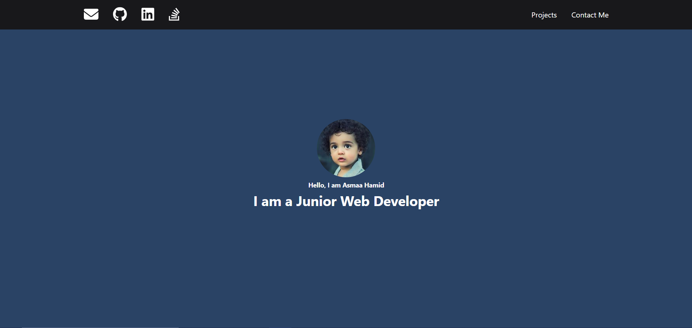
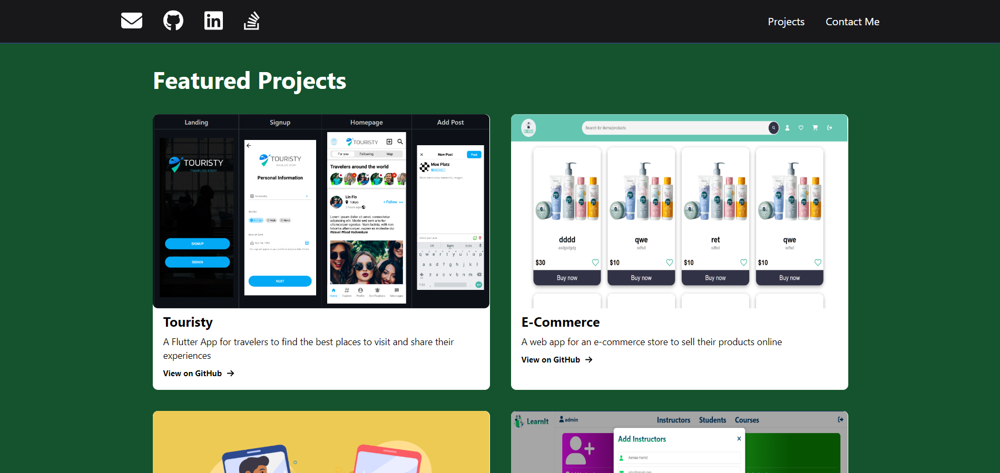
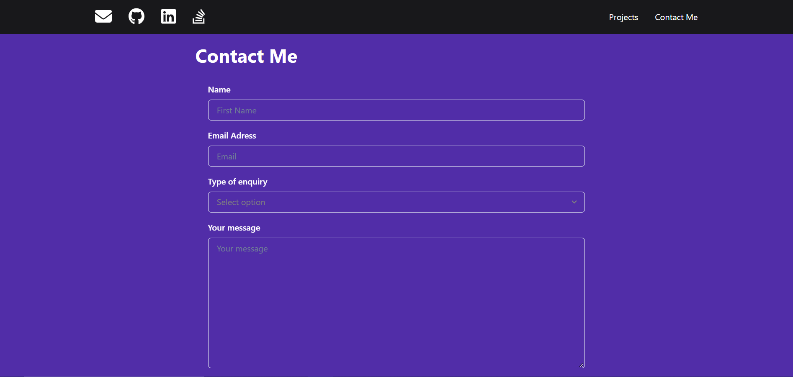
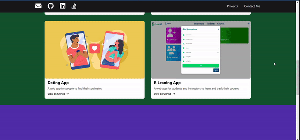
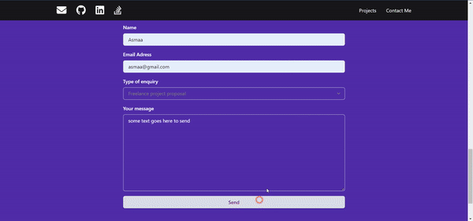

# Portfolio 
>A simple portfolio website built using ReactJS  and Chakra UI and Formik with Yup for form validation.

# Features
- Components
- Header with external and internal links
- Context
- Custom Hooks - useSubmit
- Formik - useFormik hook
- Yup
- Chakra UI

# Installation
- Clone the repo
- Run `npm install` to install dependencies
- Run `npm start` to start the development server

# Implementation

### Landing Section

### Projects Section

### Contact Section

### Show/Hide Header

### Form Submission

